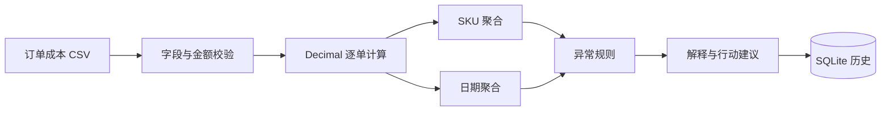

# Amazon Profit Diagnostic Agent

> Recalculate ecommerce profit deterministically and explain where margin is being lost.

[](https://github.com/JimMinseay3/crossborder-profit-diagnostic-agent/actions/workflows/ci.yml)


利润异常诊断 Agent 将订单收入、退款、采购成本、Amazon 费用、广告费和物流费还原成按订单、SKU、日期可复算的 USD 利润账。所有金额使用确定性 `Decimal` 计算；模型只可增强解释，绝不参与财务数值计算。

## 核心能力

- 逐行校验订单、SKU、件数和金额字段。
- 计算收入、退款、COGS、平台费、广告费、物流费、净利润和净利率。
- 按 SKU 与日期聚合经营结果。
- 发现低毛利、高退款、高广告占比和高平台费占比。
- 识别“收入上升但净利润下降”的日期信号。
- 对缺失 COGS 明确警告利润可能被高估。
- 保存完整公式、步骤、证据和运行历史。

## 计算链路



```text
net_profit = revenue - refunds - cogs - amazon_fees - ad_spend - shipping
net_margin_pct = net_profit / revenue × 100
```

## 快速开始

```powershell
git clone https://github.com/JimMinseay3/crossborder-profit-diagnostic-agent.git
cd crossborder-profit-diagnostic-agent
python -m venv .venv
.\.venv\Scripts\Activate.ps1
python -m pip install -r requirements.txt
python -m uvicorn app.main:app --reload --port 8104
```

访问 [http://127.0.0.1:8104](http://127.0.0.1:8104)，选择 `profit_ledger.csv`。

## CSV 输入

| 字段 | 含义 |
|---|---|
| `date` | 订单核算日期 |
| `order_id` | 订单号 |
| `sku` | 商品 SKU |
| `units` | 件数 |
| `revenue` | 收入 |
| `refunds` | 退款 |
| `cogs` | 商品成本 |
| `amazon_fees` | Amazon 费用 |
| `ad_spend` | 广告花费 |
| `shipping` | 物流费用 |

第一版统一使用 USD，单次文件上限为 3 MB。缺失 COGS 会按 0 进入计算，但同时降低置信度并强制提示人工复核。

## 异常基线

- 净利率低于 10%。
- 退款超过收入的 20%。
- 广告花费超过收入的 30%。
- Amazon 费用超过收入的 25%。
- 相邻日期收入上升但净利润下降。

这些阈值是原型基线，不是适用于所有类目的经营标准。

## API

| 方法 | 路径 | 用途 |
|---|---|---|
| `GET` | `/` | 中文网页 |
| `GET` | `/health` | 健康检查 |
| `GET` | `/api/examples` | 样例列表 |
| `POST` | `/api/runs` | 核算和诊断 |
| `GET` | `/api/runs` | 历史记录 |
| `GET` | `/api/runs/{run_id}` | 运行详情 |
| `GET` | `/api/runs/{run_id}/export` | JSON 导出 |

```bash
curl -X POST http://127.0.0.1:8104/api/runs \
  -H "Content-Type: application/json" \
  -d '{"example":"profit_ledger.csv"}'
```

## 配置与测试

默认离线 `mock` 模式；复制 `.env.example` 可以配置 OpenAI 解释增强及数据库位置。

```powershell
python -m pytest -q
```

测试包含利润公式复算、异常发现、不完整 CSV 拒绝、接口与 SQLite，以及模型错误回退。

## 责任边界

- 不连接 Amazon 结算账户，不发起付款或费用申诉。
- 输出是经营分析原型，不替代会计、税务或审计意见。
- 模型生成内容不能覆盖确定性金额。
- 使用真实数据前请删除或脱敏客户个人信息。

## Roadmap

- 平台结算单与物流账单自动对账。
- 多币种及汇兑损益拆分。
- 可配置异常阈值、预算和类目基线。
- 周期对比、贡献利润和现金流预测。

## License

[MIT](LICENSE) © 2026 JimMinseay3
